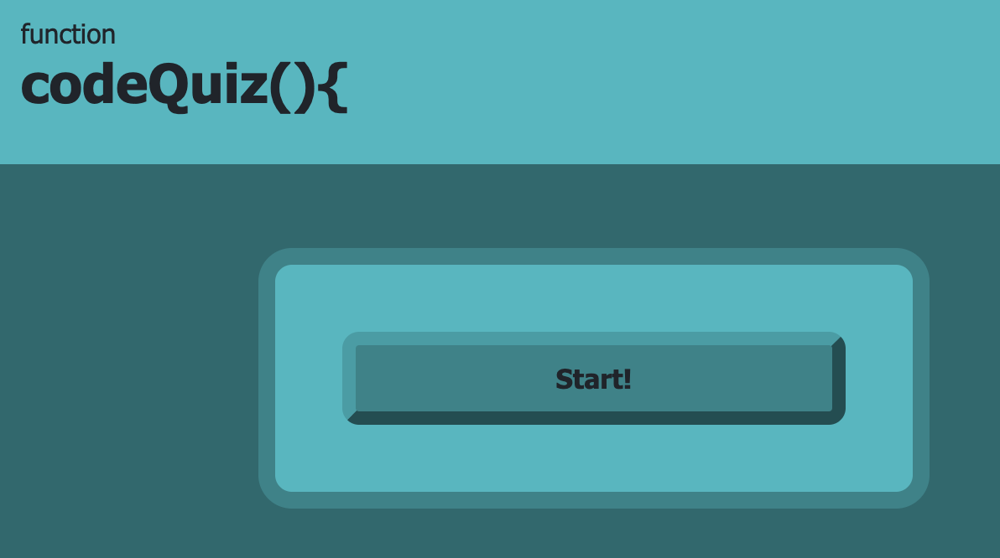
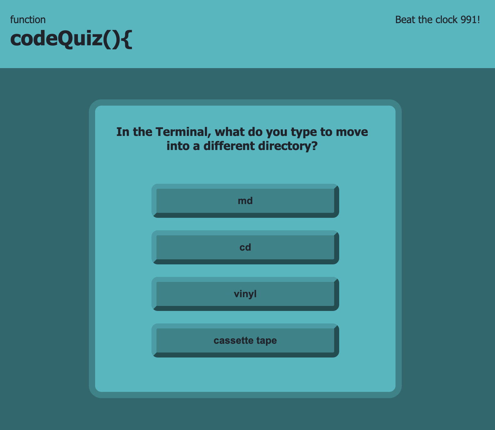
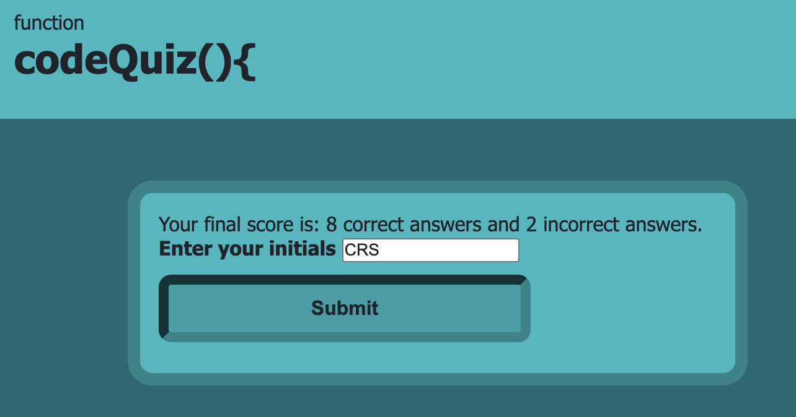
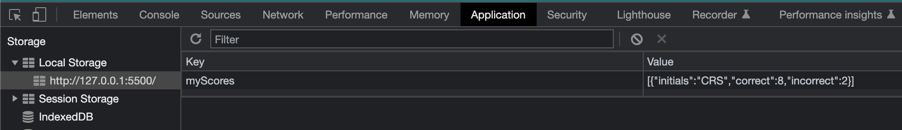

# function codeQuiz(){

## Description

This code quiz allows you to test your coding knowledge!  But be careful, if you miss a question, your time will be docked!

In creating this app, I learned about nested functions, event listeners, and local storage.

## Installation

N/A

## Usage

Click the start button to begin!

Select your answer.  But be careful - time is running out!

See your score and enter your initials.

Save your scores to your local storage.

## Credits
- HTML input type="text". (n.d.). W3Schools. Retrieved March 13, 2023, from https://www.w3schools.com/tags/att_input_type_text.asp
- HTML button tag. (n.d.). W3Schools. Retrieved March 13, 2023, from https://www.w3schools.com/tags/tag_button.asp
- HTML | DOM Style display Property. (2022, June 5). GeeksforGeeks. Retrieved March 13, 2023, from https://www.geeksforgeeks.org/html-dom-style-display-property/
- CSS Variables - The var() function. (n.d.). W3Schools. Retrieved March 13, 2023, from https://www.w3schools.com/css/css3_variables.asp
- AskBCS Learning Assistant, 13MAR2023 
- Change text inside h2 Text I would change h2 element using javascript. (2014, April 24). Stack Overflow. Retrieved March 13, 2023, from https://stackoverflow.com/questions/23274274/change-text-inside-h2-text-i-would-change-h2-element-using-javascript
- HTML DOM Element textContent Property. (n.d.). W3Schools. Retrieved March 13, 2023, from https://www.w3schools.com/jsref/prop_node_textcontent.asp
- JavaScript: Insertion of Elements | I'd Rather Be Writing Blog. (n.d.). Idratherbewriting.com. Retrieved March 13, 2023, from https://idratherbewriting.com/insertion-of-elements-javascript/
- iCloud Drive > Documents > Wed Development > Getting Started > AC Personality Types copy
- onclick Event. (n.d.). W3Schools. Retrieved March 13, 2023, from https://www.w3schools.com/jsref/event_onclick.asp
- SOLVED Cannot Read Property 'addEventListener' of Null in JS. (2022, November 14). Coding Beauty. Retrieved March 13, 2023, from https://codingbeautydev.com/blog/javascript-cannot-read-property-addeventlistener-of-null/
- Quick, J. Q. (n.d.). Build a Quiz App. YouTube. Retrieved March 13, 2023, from https://www.youtube.com/watch?v=rFWbAj40JrQ&list=PLDlWc9AfQBfZIkdVaOQXi1tizJeNJipEx&index
- Coyier, C. (2013, April 8). A Complete Guide to Flexbox | CSS-Tricks. CSS-Tricks. Retrieved March 14, 2023, from https://css-tricks.com/snippets/css/a-guide-to-flexbox/
- HTML Global class Attribute. (n.d.). W3Schools. Retrieved March 14, 2023, from https://www.w3schools.com/tags/att_global_class.asp
- Color Picker — HTML Color Codes. (n.d.). HTML Color Codes. Retrieved March 14, 2023, from https://htmlcolorcodes.com/color-picker/
- Office Hours 14MAR2023
- How to align a button in the center of the div. (n.d.). Educative.io. Retrieved March 14, 2023, from https://www.educative.io/answers/how-to-align-a-button-in-the-center-of-the-div
- Tutoring 14MAR2023
- How to create a countdown timer using JavaScript. (n.d.). Educative.io. Retrieved March 14, 2023, from https://www.educative.io/answers/how-to-create-a-countdown-timer-using-javascript
- 10 Minute Countdown Clock. (n.d.). CodePen. Retrieved March 14, 2023, from https://codepen.io/yaphi1/pen/KpbRZL
- Office hours 15MAR2023: https://jsbin.com/boqanit/edit?html,js,output 
- Tutoring 16MAR2023: saving to local storage

## License

MIT License

## Deployed Application Link

Paste your deployed application link here.